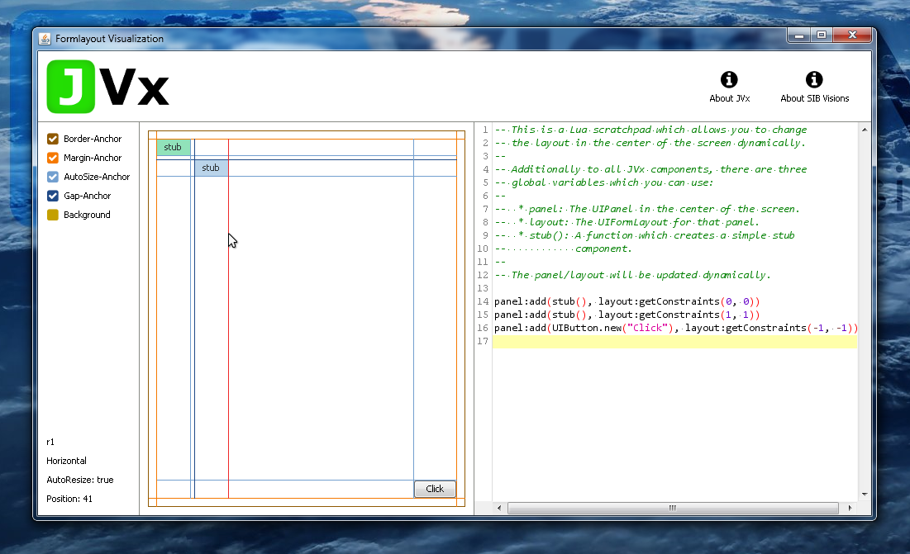

# jvx.formlayout-visualization

A demonstration application which allows to inspect the anchors of
the FormLayout.

# Usage

Launch the project with the attached launcher or build it and launch
the resulting jar.

See also the [FormLayout Documentation](https://doc.sibvisions.com/jvx/reference?s[]=formlayout#formlayout)

# License

jvx.formlayout-visualization is licensed under Apache 2.0.

The licenses of the dependencies are as follows (please see the attached license
files for further information and details):

  * Apache Commons BCEL, Apache 2.0
  * JCommon, LGPLv2.1
  * JVx, Apache 2.0
  * JVx Lua, Apache 2.0
  * LuaJ, LuaJ License (BSD-like)
  * RSyntaxTextArea, BSD-like

# Dependencies

Java 1.8 is required for this application.

Additional dependencies are:

  * [Apache Commons BCEL](https://commons.apache.org/proper/commons-bcel/index.html)
  * [JCommon](http://www.jfree.org/jcommon/)
  * [JVx](https://sourceforge.net/projects/jvx/)
  * [JVx Lua](https://github.com/sibvisions/jvx.lua)
  * [LuaJ](http://www.luaj.org/luaj.html)
  * [RSyntaxTextArea](https://github.com/bobbylight/RSyntaxTextArea)
